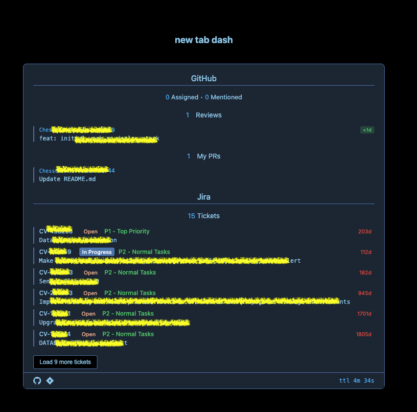

# New Tab Dashboard

A clean, dark-themed browser start page that displays your GitHub pull request review requests, your own open pull requests, and Jira tickets. Built with pure HTML/CSS/JavaScript and a companion Chrome extension for CORS handling.



## Features

- Dark theme with clean, modern design
- Shows open PR reviews assigned to you
- Shows your own open pull requests
- Shows your open Jira tickets
- Status indicators for GitHub and Jira connections
- Settings panel for configuration
- Caching to reduce API calls
- Cross-browser compatible
- Responsive design
- Secure token management

## Quick Start

1. Download or clone this repository
2. Install the companion Chrome extension (see Extension Setup below)
3. Set up your GitHub and Jira tokens (see Configuration below)
4. Set the dashboard as your new tab page

## Installation

### 1. Main Dashboard Setup

1. Download or clone this repository
2. Set `new_tab_dash.html` as your new tab page:
   - Chrome: Go to `chrome://settings/` > "On startup" > "Open a specific page" > Add `file:///path/to/new_tab_dash.html`
   - Firefox: Go to `about:preferences` > "Home" > "Custom URLs" > Add `file:///path/to/new_tab_dash.html`
   - Safari: Go to `Safari > Preferences > General` > Set "New tabs open with" to "Homepage" > Set homepage to `file:///path/to/new_tab_dash.html`

### 2. Extension Setup

The companion extension handles CORS for Jira and GitHub API requests:

1. Open Chrome and go to `chrome://extensions/`
2. Enable "Developer mode" in the top right
3. Click "Load unpacked" and select the `new-tab-dash-extension` directory from this repository

## Configuration

### GitHub Setup

1. Click the gear icon in the bottom left of the new tab page
2. Generate a GitHub token:
   - Go to https://github.com/settings/tokens
   - Click "Generate new token"
   - Select the `repo` scope
   - Copy the token
3. Paste the token in the GitHub configuration section
4. Click "Save Token"

### Jira Setup

1. Click the gear icon in the bottom left of the new tab page
2. Generate a Jira API token:
   - Go to https://id.atlassian.com/manage/api-tokens
   - Click "Create API token"
   - Copy the token
3. Enter your Jira configuration:
   - Domain: Your Jira domain (e.g., `chesscom` for `chesscom.atlassian.net`)
   - Email: Your Jira account email
   - API Token: The token you generated
4. Click "Save Jira Config"

## Usage

- The dashboard automatically refreshes every 5 minutes
- Click the gear icon to access settings
- Click the refresh icon to manually refresh data
- Hover over status icons to view connection details
- Click the clear icon to remove stored tokens

## Troubleshooting

### CORS Issues

If you see CORS errors in the console:
1. Make sure the extension is properly loaded
2. Check that the background script is running
3. Verify the extension has the necessary permissions
4. Try reloading the extension

### API Token Issues

If GitHub or Jira connections fail:
1. Verify your tokens are correct
2. Check that the tokens have the necessary permissions
3. Try generating new tokens
4. Check the browser console for error messages

### Cache Issues

If data isn't updating:
1. The cache refreshes every 5 minutes
2. You can force a refresh by clicking the refresh icon
3. Check the cache timer in the bottom right
4. Clear your browser cache if issues persist

## Development

### Modifying the Dashboard

1. Make changes to `new_tab_dash.html`
2. Reload your new tab page to see changes

### Modifying the Extension

1. Make changes to files in `new-tab-dash-extension/`
2. Go to `chrome://extensions/`
3. Click the refresh icon on the extension card

### Project Structure

```
.
├── new_tab_dash.html          # Main dashboard file
├── new-tab-dash-extension/    # Chrome extension
│   ├── background.js          # CORS handling
│   └── manifest.json          # Extension config
├── README.md                  # This file
├── TODO.md                    # Planned features
└── CLEANUP.md                 # Code improvements
```

## Contributing

1. Fork the repository
2. Create a feature branch
3. Make your changes
4. Submit a pull request

## License

MIT License - See LICENSE file for details 